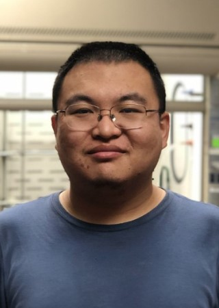
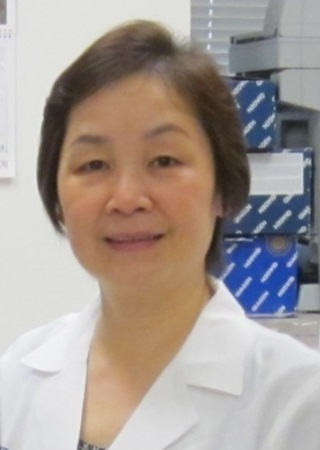
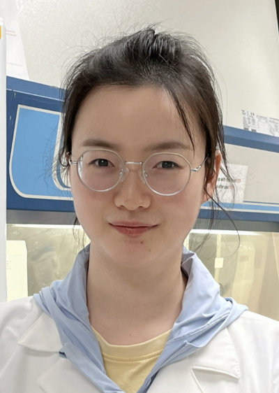

```{r setup, include=FALSE}
knitr::opts_chunk$set(echo = TRUE)
```
```{r load_packages, message=FALSE, warning=FALSE, include=FALSE} 
library(fontawesome)
```

## Postdoctoral Research Fellows
\
**Yong Lu** 
[`r fa(name = "envelope", fill = "steelblue")`](mailto:<Yong.Lu@utsouthwestern.edu>) 
[`r fa(name = "phone", fill = "steelblue")`](tel:214-648-8925)\
Ph.D. Peking University\
Advisor: Zhen Yang\
\
\
**Bingnan Wang** 
[`r fa(name = "envelope", fill = "steelblue")`](mailto:<Bingnan.Wang@utsouthwestern.edu>) 
[`r fa(name = "phone", fill = "steelblue")`](tel:214-648-8925)\
Ph.D. Zhejiang University\
Advisor: Hanfeng Ding\
\

## Research Staffs
\
**Liping Li** 
[`r fa(name = "envelope", fill = "steelblue")`](mailto:<Liping.Li@utsouthwestern.edu>) 
[`r fa(name = "phone", fill = "steelblue")`](tel:214-648-8925)\
Research Scientist\
\
\
**Qian Wang** 
[`r fa(name = "envelope", fill = "steelblue")`](mailto:<Qian.Wang@utsouthwestern.edu>) 
[`r fa(name = "phone", fill = "steelblue")`](tel:214648-8925)\
Senior Research Associate\
\
\
**Liping Yao** 
[`r fa(name = "envelope", fill = "steelblue")`](mailto:<Liping.Yao@utsouthwestern.edu>) 
[`r fa(name = "phone", fill = "steelblue")`](tel:214648-8925)\
Research Assistant\
\

## Former Graduate Student
**Xiao Wang**\
2006–2012\
B.S., Peking University\
Advisor: Prof. Jiaxi Xu\
Current: Senior Scientist, Merck\
\

## Former Postdoctoral Research Fellows
**Chen Zhu**\
2013\
Ph.D., Shanghai Institute of Organic Chemistry\
Advisor: Prof. Guo-Qiang Lin\
Current: Professor, Suzhou University\
\
**Chengwei Zhang**\
2015–2016\
Ph.D. Shanghai Institute of Organic Chemistry\
Advisor: Prof. Chaozhong Li\
\
**Fei Tan**\
2019–2020\
Ph.D. Sichuan University\
Advisor: Prof. Xiaoming Feng\
\
**Heping Shi**\
2010–2017\
Ph.D., Shanghai Institute of Organic Chemistry\
Advisor: Prof. Biao Jiang\
\
**Jen-Chieh Hsieh**\
2008\
Ph.D., National Tsing Hua University\
Advisor: Prof. Chien-Hong Cheng\
\
**Jianming Lu**\
2005–2011\
Ph.D., Nankai University\
Advisor: Prof. Jin-Pei Cheng\
\
**Jibao Xia**\
2010–2015\
Ph.D. Shanghai Institute of Organic Chemistry\
Advisor: Prof. Shu-Li You\
Current: Professor, Lanzhou Institute of Chemical Physics\
\
**Jing Li**\
2013–2015\
Ph.D., Peking University Health Science Center\
Advisor: Prof. Yanxing Jia\
\
**Lei Han**\
2016–2019\
Ph.D., Shanghai Institute of Organic Chemistry\
Advisor: Prof. Biao Jiang\
\
**Lin You**\
2016 - 2021\
Ph.D., Peking University\
Advisor: Prof. Zhen Yang\
Current: Research Investigator, Incyte\
\
**Qi Wei**\
2015–2018\
Ph.D. Shanghai Institute of Organic Chemistry\
Advisor: Prof. Shengming Ma\
\
**Qiaoling Wang**\
2006–2011\
Ph.D., Lanzhou University\
Advisor: Prof. Xuegong She\
\
**Saptarshi De**\
2013–2014\
Ph.D., Wayne State University\
Advisor: Prof. Jim Rigby\
Current: Principal Investigator, DuPont\
\
**Shuanhu Gao**\
2007–2010\
Ph.D., Lanzhou University\
Advisor: Prof. Yong-Qiang Tu\
Current: Professor, Department of Chemistry, East China Normal University\
\
**Xianghui Tan**\
2004–2008\
Ph.D., University of Science and Technology of China\
Advisor: Prof. Qing-Xiang Guo\
Current: Chief Technology Officer, ChemPacific Corportation\
\
**Xiaolei Wang**\
2011–2015\
Ph.D. Lanzhou University\
Advisor: Prof. Xuegong She\
Current: Professor, Department of Chemistry, Lanzhou University\
\
**Yuanwei Dai**\
2015–2017\
Ph.D., Shanghai Institute of Organic Chemistry\
Advisor: Prof. Biao Yu\
\
**Yuyong Ma**\
2013–2015\
Ph.D., Shanghai Institute of Organic Chemistry\
Advisor: Prof. Biao Yu\
\
**Zhiqiang Ma**\
2007–2015\
Ph.D., Shanghai Institute of Organic Chemistry\
Advisor: Prof. Hongbin Zhai\
Current: Professor, School of Chemistry and Chemical Engineering, South China University of Technology\
\

## Former Summer Undergraduate Students
**Benjamin Kernen**\
2015\
Summer Intern from University of North Texas\
\
**Julian Maceren**\
2019\
Amgen Scholar from Rochester University\
\
**Khoa Nguyen**\
2012\
QP-SURF student from the University of Texas at Arlington\
\
**Lauren Garofalo**\
2010\
QP-SURF student from Baylor University\
\
**Matthew Bedard**\
2015\
Summer Intern from Vanderbilt University\
\
**Nyle Sharif**\
2019\
QP-SURF student from Northeastern University\
\
**Phillip Steininger**\
2008\
QP-SURF student from Washington University\
\
**Rae McFarlin**\
2009\
QP-SURF student from Texas Woman's University\
\
**Vivian Shaw**\
2006–2007\
Summer Intern from University of Pennsylvania\
\

## Former Summer High School Students
**Adrian Bustos**\
2011\
STARS student from Talented and Gifted School at Townview\
\
**Michael Gao**\
2022\
Summer Intern from St. Mark's School of Texas\
\
**Bao (Manny) Nguyen**\
2010\
STARS student from Haltom High School\
\
**Brian Chhor**\
2008\
STARS student from Yvonne A. Ewell Townview Magnet Center, The School for the Talented and Gifted\
\
**John La**\
2012\
STARS student from the School of Science and Engineering Magnet\
\
**Karen De La Fuenta**\
2009\
STARS student from the Science and Engineering Magnet at Townview
